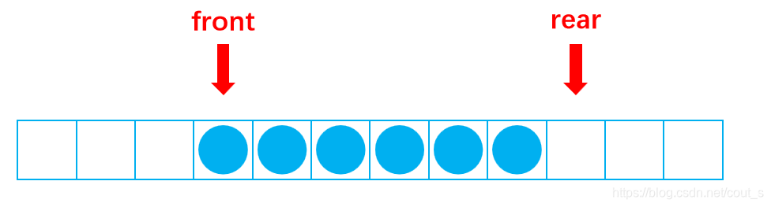
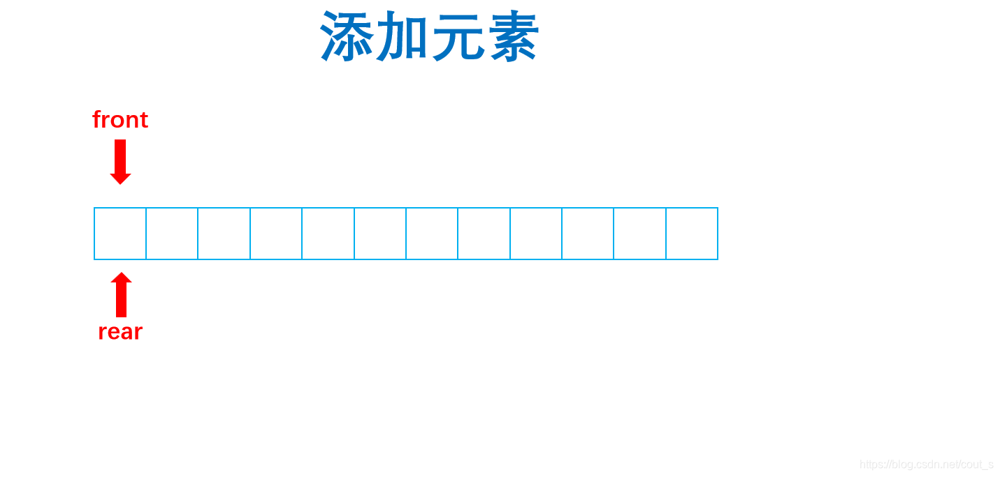
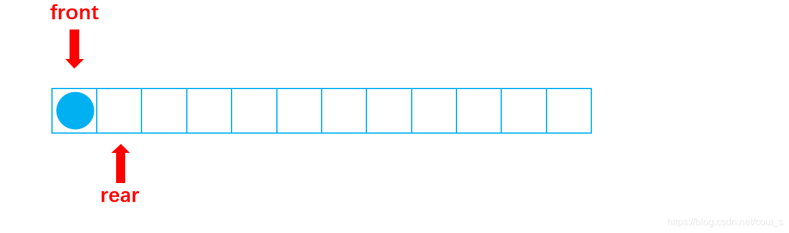
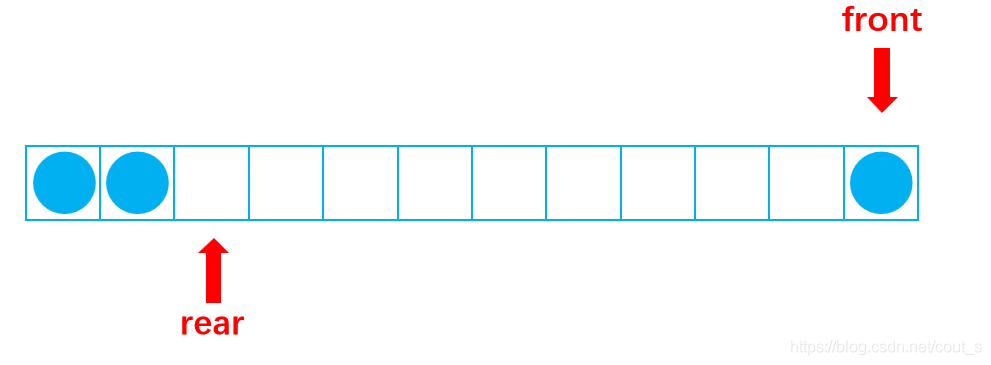
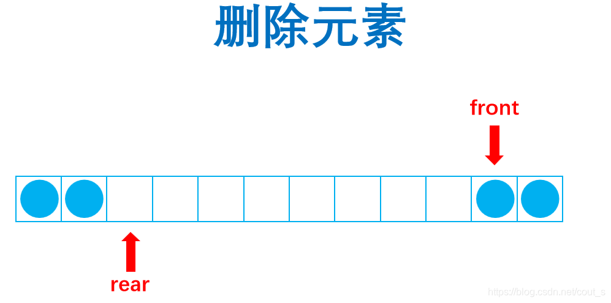
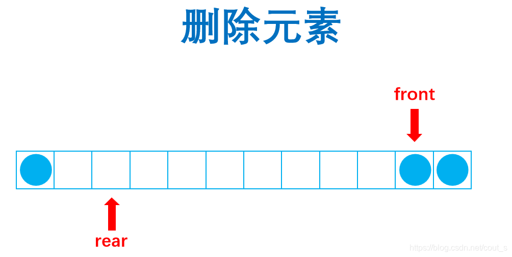
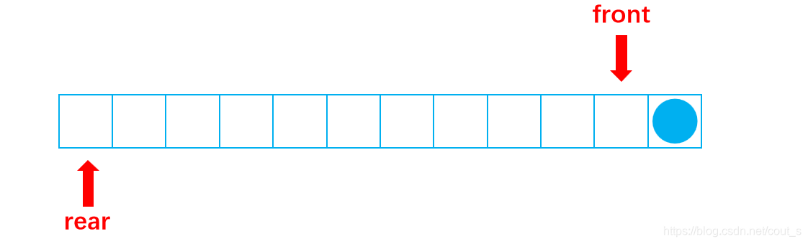

# 双端队列
## 定义
双端队列(double ended queue,deque)是限定插入和删除操作在表两端进行的线性表，是具有队列和栈性质的数据结构。

## 实现
双端队列和循环队列的创建过程类似，都需要两个类似指针的标签，分别指向对首和队尾的下一个，因为要留一个null空间出来，方便判断队列满的条件。如下图：



初始状态front、rear都是指向双端队列的头部，图中的显示并不是表示循环对列从中间开始增加元素，并往两头走的情况。所以这一点还是值得注意！

## 示意图
### 1.初始状态



### 2.增添元素
#### (1)addLast();队尾添加元素


#### (2.addFirst());队头添加元素


### 3.删除元素

#### （1）removeLast();


#### (2)removeFirst();移除列首元素


## 实现代码
```java
public interface Deque<E> extends Iterable<E> {//双端对列的接口
	void addFirst(E element);//在列首添加元素
	void addLast(E element);//在列尾添加元素
	E removeFirst();//在列首删除元素
	E removeLast();//在列尾部删除元素
	E getFirst();//获取列首元素
	E getLast();//获取列尾元素
	int size();//获取有效长度
	boolean isEmpty();//判段是否为空

}
```
实现类
```java
import java.util.Iterator;

public class ArrayDeque<E> implements Deque<E> {
	private E[] data;
	private int size;
	private int front;
	private int rear;
	private static int DEFAULIT_CAPACITY = 10;
			
	public ArrayDeque() {
	    size = 0;
	    rear = 0;
	    front = 0;
	    data = (E[])new Object[DEFAULIT_CAPACITY+1];
	}
	@Override
	public Iterator<E> iterator() {
		return null;
	}
	private class ArrayDequeiterator<E> implements Iterator<E>{
		 
	    private int cur =front;

		@Override
		public boolean hasNext() {
			return cur!=rear;
		}

		@Override
		public E next() {
			E ret = (E) data[cur];
			cur = (cur+1)%data.length;
			return ret;
		}
	}

	@Override
	public void addFirst(E element) {//往列头添加元素
		if((rear+1)%data.length==front) {//判断队列满的时候
			resize(2*data.length-1);//扩容的方法
		}
		front = (front-1+data.length)%data.length;//防止列表头指针溢出，所以进行取data.length余数
		data[front] = element;
		size++;
	}
    
	public void resize(int newlength) {//扩容
		E[] newData =(E[]) new Object[newlength];//定义一个新元素数组
		int i = 0;//计数
		while(front!=rear) {//当遍历到front==rear，循环列表遍历结束
			newData[i++] = this.data[front];
			front = (front+1)%data.length;
		}
		data = newData;
		front = 0;
		rear = i;
	}

	@Override
	public void addLast(E element) {
		if((rear+1)%data.length==front) {
			resize(2*data.length-1);
		}
		data[rear]=element;
		rear = (rear+1)%data.length;
		size++;
	}

	@Override
	public E removeFirst() {
		E ret = data[front];//取元素
		if(size<(data.length-1)/4&&data.length-1>DEFAULIT_CAPACITY) {//缩容
			resize(data.length/2+1);
		}
		front = (front+1)%data.length;
		size--;
		return ret;
	}

	@Override
	public E removeLast() {
		if(size<(data.length-1)/4&&data.length-1>DEFAULIT_CAPACITY) {
			resize(data.length/2+1);
		}
		rear = (rear-1+data.length)%data.length;		
		E ret = data[rear];
		size--;
		return ret;
	}

	@Override
	public E getFirst() {
		return data[front];
	}

	@Override
	public E getLast() {
		return data[rear-1];
	}
	@Override
	public String toString() {
		StringBuilder sb = new StringBuilder();
		sb.append('{');
		int i =rear,j=front;
		while(rear!=front) {
			sb.append(data[front]);
			front = (front+1)%data.length;
			if(rear==front) {
				sb.append('}');
				break;
			}else {
				sb.append(',');
			}
		}
		rear = i;
		front = j;
		return sb.toString();
	}
	@Override
	public int size() {
		return size;
	}

	@Override
	public boolean isEmpty() {
		return size==0;
	}
}
```