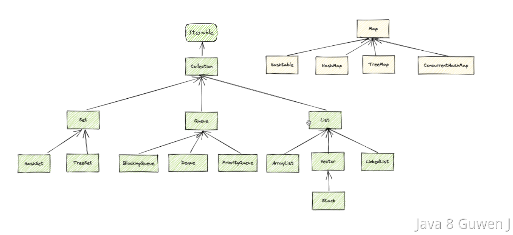

## Java中的集合类有哪些？如何分类的？

java的集合主要`java.unit`包下，主要分为list、set、stack、queue和map等五种数据结构
，其中前面四种都是单一元素集合，map是KV对形式。

- **List（列表）** - 有序集合，可以包含重复的元素。 
  - `ArrayList`：基于**动态数组**实现，提供快速的随机访问和快速的遍历。 
  - `LinkedList`：基于链表实现，便于插入和删除操作。 
  - `Vector`：和ArrayList类似，但是它是同步的。 
  - `Stack`：继承自Vector，实现了一个后进先出的堆栈。 
> 留意列表的特性，意味着他们的应用场景。ArrayList是动态数组，就相对于Array而言，其可以动态扩容。
- **Set（集）** - 不允许重复元素的集合。 
  - `HashSet`：基于哈希表实现，存取速度快，不保证有序。
  - `LinkedHashSet`：类似于HashSet，但是维护了一个运行于所有条目的双重链接列表，这样能保证元素以插入顺序被迭代。
  - `TreeSet`：基于红黑树实现，元素会按照某种比较规则进行排序。
- **Queue（队列）** - 保证元素按照特定顺序排列的集合。 
  - LinkedList：可以用作队列的实现。 
  - PriorityQueue：元素按照其自然顺序或者构造时指定的Comparator进行排序。
- **Map（映射）** - 存储键值对，通过键来唯一确定值。 
  - HashMap：基于哈希表的Map接口实现，不保证映射的顺序。 
  - LinkedHashMap：类似于HashMap，但是维护了一个运行于所有条目的双重链接列表，这样能保证键值对以插入顺序或访问顺序被迭代。 
  - TreeMap：基于红黑树实现，每个键值对会按照键的自然顺序或者构造时提供的Comparator进行排序。 
  - Hashtable：是一个古老的Map实现，它是同步的。

java还提供了其他特殊集合类。如枚举集合（EnumSet），位集合（BitSet），以及各种并发集合（如ConcurrentHashMap）等。

那这道题主要考什么呢？
+ java集合框架的理解。是否熟悉Java的集合框架及各个集合的用途和特点；
+ 数据结构的知识。通过对集合类的分类和特性的描述，可以知道你对数据结构（栈、队列、链表、哈希表等）的理解；
+ 使用场景分析能力：可以展开说说集合类的使用场景。可以说下自己在工作中使用的。
  > 如ArrayList是我们最常用到的，用于动态盛放数据对象、并进行数据集合的传输；
  > 还有HashMap，当对需要两个列表进行匹配时，可以根据匹配key将一个列表转成map，然后复杂度由O(n^2)变为O(n)；
  > 还有TreeSet，我们这边需要对任务列表按照日期做排序，当判断当前日期是开始日期时才进行处理，并更新状态。
  > ConcurrentHashMap：资源共享与竞争时，后续补充。
+ 性能考虑。了解每种集合的性能特性，理解使用什么操作，及其对应的时间复杂度；
+ 并发编程知识。通过线程安全的集合类（如Vector、ConcurrentHashMap）引申并发编程和线程安全。
    > 线程安全：多个线程，对资源的访问，是安全的，不会不一致。
+ Java集合API，对Api的熟悉程度。
+ 扩展问题准备：根据你的回答，面试官可能会继续提问，例如集合类的内部工作原理、如何自定义排序规则、集合类的设计模式等。

> 个人回答：集合类在java.util包下，集合类涉及的数据结构有list、stack、set、queue和map五种数据结构。其中对于这五种数据结构，他们有各自相应的集合实现类。
> 如对于list，其常用的实现类：ArrayList，LinkedList，其中stack也是通过实现list完成的，set的实现类有HashSet，LinkedHashSet、TreeSet；
> 对于map而言，其实现类可以参照set，其有HashMap、LinkedHashMap，TreeMap以及HashTable；
> 对于queue的实现类常用的就是LinkedList、Deque、PriorityQueue。

对于数据结构的实现类，可以说下其中涉及到的比较经典的算法。如map和set一定会涉及到hash函数，这可以展开说说；
对于TreeSet的实现会提及到红黑树，也可以展开说说红黑树，然后根据红黑树的特性、优缺点继续引申树相关的知识和特性