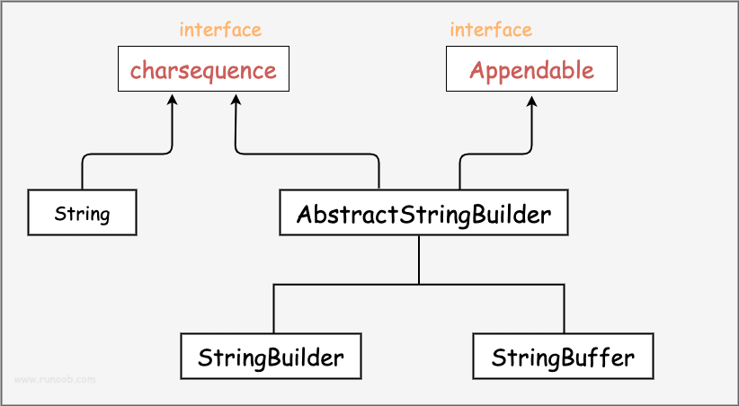

# StringBuilder和StringBuffer的理解。

String、StringBuilder 和 StringBuffer 都是在Java中用来处理字符串的类，但它们在性能和用途上有一些区别。

1、String 类表示不可变的字符序列。一旦创建了一个字符串，它的值就不能被改变。每次对字符串进行修改时，都会创建一个新的字符串对象，这可能会导致内存开销和性能问题。**适用于存储不需要频繁修改的字符串**。

2、StringBuilder 类用于创建和操作可变的字符序列。它的主要优点是在进行字符串拼接或修改操作时，不会像 String 那样创建新的对象，而是直接在原始对象上进行修改，因此性能较好。**适用于需要频繁进行字符串修改的情况。**

3、StringBuffer 与 StringBuilder 类似，也是用于创建和操作可变的字符序列。不同的是，StringBuffer 是线程安全的，即多个线程可以同时访问和修改同一个 StringBuffer 对象而不会导致数据不一致的问题。这种线程安全性是通过在每个方法上添加同步锁来实现的。因此，在需要在多线程环境下进行字符串操作时，可以考虑使用 StringBuffer。

## 性能比较
> StringBuilder > StringBuffer >? String。

### StringBuilder优于String
由于 String 是不可变的，每次对字符串进行修改或拼接操作时，都需要创建一个新的字符串对象，旧的字符串对象会被丢弃。这会导致频繁的内存分配和垃圾回收，影响性能。相比之下，StringBuilder 可以在原始对象上直接进行操作，避免了不必要的内存分配和垃圾回收，因此在拼接较长字符串或频繁修改字符串时，性能会更好。

一般对String进行拼接时，实际上是采用实例化StringBuilder，执行append操作完成的。综合来说，在操作字符串比较多的情况下，用StringBuilder优于String。

注意：在某些特定场景下，尤其是处理少量、短小的字符串时，String 的性能可能会更好，因为虽然 StringBuilder 的内部操作会带来一些开销。

### StringBuilder优于StringBuffer
StringBuilder优于StringBuffer，他们最大的差别是线程安全性。其中StringBuilder是非线程安全的，没有采用同步锁；StringBuffer是线程安全的，因为StringBuffer在每个方法中采用了同步锁，从而会有性能开销。

从而StringBuilder优于StringBuffer。

### StringBuffer优于String？
StringBuffer 和 String 都是 Java 中用来处理字符串的类，但它们有不同的特点和用途。

String 类代表不可变的字符序列。这意味着一旦一个字符串对象被创建，就不能再修改它的内容。每当对字符串进行操作（如拼接、替换等），都会创建一个新的字符串对象，原始对象不会受到影响。这可能导致在频繁进行字符串操作时产生大量的临时对象，从而影响性能和内存使用。

StringBuffer 类（还有后来引入的 StringBuilder 类）则被设计用来处理可变的字符序列。它们允许对字符串内容进行修改，而不会每次都创建新的对象。这样可以避免创建大量临时对象，从而在一些情况下提高性能。

从而，若是创建对象之后基本不便，那采用String是最好的；若会对字符串频繁变更（多线程），则采用StringBuffer。

## 总结

综上所述，如果你需要在单线程环境下频繁修改字符串，可以使用 StringBuilder 获得更好的性能。如果在多线程环境下进行字符串操作，考虑使用 StringBuffer 来保证线程安全性。如果你的字符串不需要被修改，可以使用普通的 String。

## 参考
- String,StringBuilder,StringBuffer的区别：https://zhuanlan.zhihu.com/p/121610338

- Java StringBuffer 和 StringBuilder 类：https://www.runoob.com/java/java-stringbuffer.html