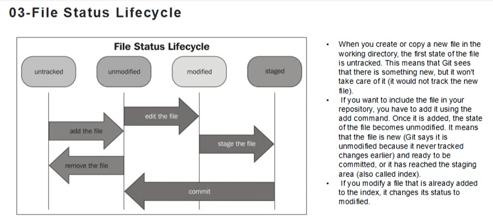
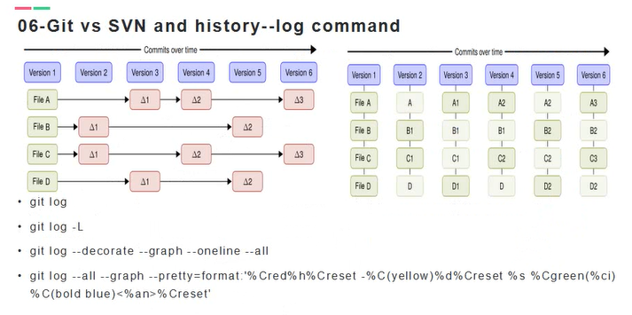
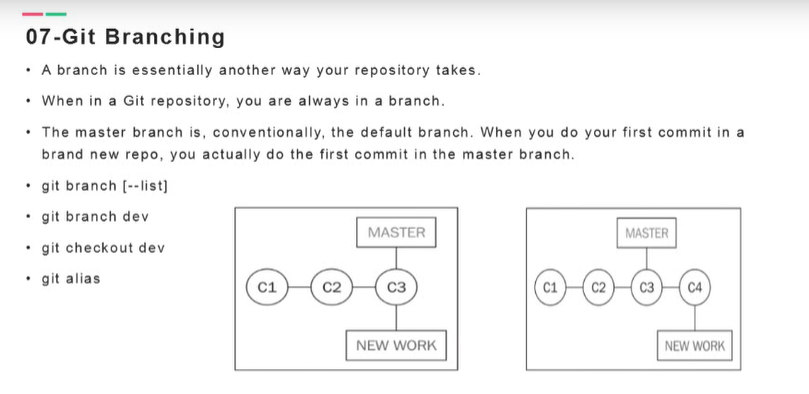
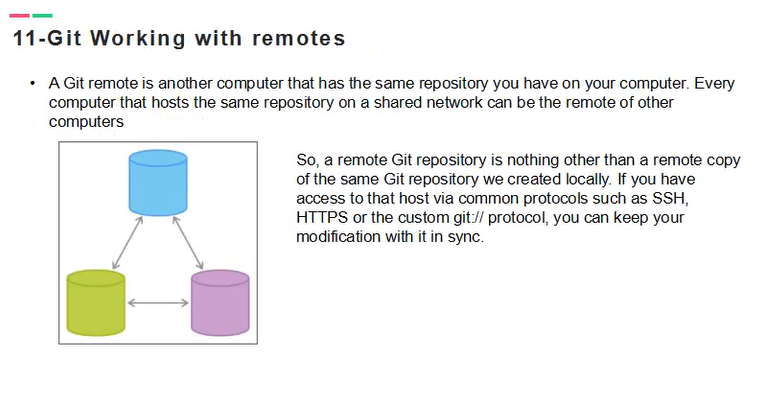

视频来源：https://www.bilibili.com/video/BV1ib411M7u8?p=1

## lesson01 笔记

git本地仓库创建：
+ mkdir -r /home/data/git
+ cd /home/data/git
+ git init
+ git status
+ echo "hello git " >> a.txt
+ cat a.txt

+ git status

查看 add 命令帮助
+ git help add

添加文件到本地仓库
+ git add a.txt
+ 提交到本地仓库
git commit -m "comment"

创建一个新文件，再次查看status
+ echo "ddd" >> b.txt

提交所有的东西
+ git add --all

查看提交日志
+ git log 
+ git log --oneline

假设对文件进行修改
+ echo "bbb" >> a.txt
+ git status
+ git add b.txt
+ git commit -m "add a new line for b.txt"

## lesson02 

Git Configuration三个不同级别
+ local git/config
+ global ~/gitconfig
+ system /etc/gitconfig

### local 
配置信息仅对当前目录起作用
+ git config --local --list

### global
+ git config --global --list

### system
+ git config --system --list
若system没有配置，则会报错，但会提示需要的目录

那对于local与global这两个配置信息是在哪里呢？这个可通过git config --help来查看他俩的描述信息。
+ git config --help 

其中：global的信息是放在当前用户下的目录。如我的window用户目录是：C:\Users\junode\.gitconfig

删除config信息
+ git config --global --unset user.email
+ git config --global --unset user.name

添加配置信息
git config --system user.name 'hitton'
git config --system user.email 'hitton@junode.com'

在配置全局信息后，再新建一个仓库：
+ git init
+ echo "ddd" >> a.txt
+ git status
+ git add . OR  git add --all
+ git commit -m 'add a.txt'
+ git log

通过git log 可以查看到当前user.name为hitton。

接下来我们配置global信息：
+ git config --global user.name 'junode'
+ git config --global user.email 'junode@hitton.com'

再通过编辑a.txt，commit之后，再次查看提交日志，可以看到编辑的用户信息发生了改变。
+ echo "hello a.txt" >> a.txt
+ git add .
+ git commit -m "add second line for a.txt"
+ git log

此时git log中用户信息获取的是global级别的。

从而可判断，作用域(system)越大的，优先级(system)越低。

## lenson03 File status LifeCycle

该小点主要关注文件生命周期状态是怎样切换？

查看文件状态：
+ git status

+ echo "hello a.txt" >> a.txt

+ git status

git status 操作提示a.txt untrack，若向a.txt被追踪，则需要添加add操作。

+ git add .

+ git status

此时在查看git status状态提示为unmodified.通过修改a.txt文件

+ echo "add new line" >> a.txt

再次查看文件状态
+ git status 

此时状态变为modified.

提交修改状态
+ git commit -am 'initial commit'

``-am : 表示add 和 common 操作一起进行。``

+ git status

`若想放弃某次提交操作，则可以通过checkout进行操作
比如再次进行修改a.txt后discard。`

+ echo "add third line for a.txt" >> a.txt
+ git status
+ git checkout -- a.txt

+ git cat-file -p HEAD
+ git cat-file -p 具体版本号
+ git log
+ echo "second file b.txt" >> b.txt
+ git add .
+ git commit -m "add b.txt file"

``注意，git commit -am 对于首次提交的文件是不行。
反正你操作也会报错。``
+ git status
+ git log
+ git cat-file -p HEAD
+ git cat-file -p 具体分支头hash值。

从中可以查看到当前head下存在的文件。

其中文件的hash值是如何生成的呢？
`是通过文件内容生成的hash值。 然后取hash值得前两位作为目录， 其余位数作为文件名内容。`

查看文件内容生成的hash值：
+ echo "ddd.txt" >> d.txt
+ git add .
+ git commit -m "add d.txt"

通过 git cat-file -p 具体分支头hash值，查看d.txt文件对应的hash值。
根据d.txt文件的头两位作为目录，在./.git/object/下查找
d.txt文件。

对于 d.txt文件是否是因为文件内容生成的hash值呢？
我们可以用d.txt文件内容手动生成hash值：

+ echo "ddd.txt" | git hash-object --stdin

## lesson04 Git delete command

+ the staging area or index is a virtual place that collects all the files you want to include in the next commit.
+ All the files (new or modified) you want to include in the next commit have to be staged using the git add command.
+ If you staged a file accidentally.you have to unstage it to remove it from the next commit bundle.
+ Unstaging file
+ Git reset is a powerful commmand,and it can completely destroy your actual work if used improperly.Do not play with it if you don't know exactly what you are doing.

在小节中，我们新建一个仓库来进行操作：
+ cd /git
+ mkdir -p lesson04
+ cd lesson04
+ git init

git init 是初始化仓库操作，可以把.git目录看做仓库目录。

+ git cat-file -p HEAD

从提示可知，HEAD并不存在，因为我们并没有添加文件到仓库被git tracked.

+ echo "hello" >> a.txt
+ git status

而若是a.txt文件不是我们想要的，此时可以通过rm -rf 进行删除

+ remove -rf a.txt

而若是我们新建的a.txt文件已经add到仓库了，此时的删除操作又该怎样进行呢？

+ echo "a.txt" >> a.txt
+ git add a.txt
+ git status
+ git rm --cached a.txt
+ git status

此时将a.txt文件从仓库中移除，没有被git tracked.但文件目录还存有a.txt，可通过rm -rf a.txt操作进行删除。

+ git status
+ git rm a.txt

此时a.txt文件被提示放到工作目录中，根据提示，根据-f强制删除

+ git rm -f a.txt

再创建一个a.txt文件
+ echo "a.txt" >> a.txt
+ git add a.txt
+ git commit -m "initial commit"
+ git status
+ git cat-file -p HEAD
+ echo "git" > b.txt
+ git add .
+ git status
+ git reset HEAD b.txt
+ git status
+ git addd .
+ git status
+ git rm --cached b.txt
+ git status
+ git add .
+ git status

彻底删除b.txt文件
+ git rm -f b.txt

``对于删除文件的总结：git add 操作：是更新操作。git checkout 操作：是放弃当前操作。``

对于删除文件而言，我们可以通过rm -rf 操作进行删除，然后通过git add .方法表示更新修改操作(即确定要删除文件)，而若是不想更新修改操作(即不想删除文件)，则可以通过git checkout完成。

## lesson 05 Git Commit Metaphor

该小节主要讲解HEAD的作用。不过没听懂。

## lesson 06 Git与其他版本的控制系统对比及git log使用详解

+ mkdir -p lesson06
+ cd lesson06
+ git init
+ echo "demo a.txt" >> a.txt;git add a.txt;git commit -m "add a.txt"
+ git log
+ echo "demo b.txt" >> b.txt;git add b.txt;git commit -m "add b.txt"
+ git cat-file -p HEAD
+ git cat-file -p file_hash_value
+ touch {1,2,3,4}
+ git add 1;git commit -m 'add 1'
+ git add 2;git commit -m 'add 2'
+ git add 3;git commit -m 'add 3'
+ git add 4;git commit -m 'add 4'

查看所有的日志信息，若信息过多，可通过翻页(enter)方式进行查看
+ git log

查看最近两次的提交信息
+ git log -2

查看git log 帮助手册信息
+ git log --help

git log oneline的作用是很大的。

## 07 git创建分支详解

git branch 若干命令学习

+ mkdir lesson07
+ git init
+ git branch --list
+ echo "a.txt" > a.txt;git add a.txt;git commit -m "initial commit"
+ git branch
+ echo "b.txt" > b.txt;git add b.txt;git commit -m "b.txt"
+ echo "c.txt" > c.txt;git add c.txt;git commit -m "c.txt"

HEAD指向哪个branch，表明你就在哪个branch里面。

+ git log --graph --oneline

打了若干个包：0.0.1(dev-0.0.1-SNAPSHOT,uat-0.0.1-SNAPSHOHT)

创建分支0.0.1
+ git branch 0.0.1
+ git branch --list

切换分支到0.0.1
+ git checkout 0.0.1
+ echo "d.txt" > d.txt;git add d.txt;git commit -m "d.txt"
+ git log --oneline
+ git log --oneline --graph

+ git checkout master
+ git log

再创建一个分支，在创建分支之前，将master和0.0.1分支merge

+ git merge 0.0.1
+ git log --oneline --graph
+ git branch 0.0.2
+ git checkout 0.0.2
+ echo "e.txt" > e.txt ; git add e.txt;git commit -m "e.txt commit"

+ git log
+ ls 
+ git check out master
+ ls
+ git checkout 0.0.2
+ git log --graph --decorate --oneline

## lesson08 Git分支合并、对比、冲突解决，分支删除等。

该小节主题：
- git create branch and checkout in one command
- git diff master dev
- git log master dev
- git merge dev

实操：

+ mkdir lesson08
+ cd lesson08
+ git init
+ echo "a.txt" > a.txt;git add a.txt;git commit -m "master brach add the a.txt"
+ git branch dev;git checkout dev;
+ echo "b.txt" > b.txt;git add b.txt;git commit -m "dev branch add the b.txt"
+ ls
+ git checkout master
+ ls

对比两个分支之间的差异

+ git diff master..dev
+ git diff dev..master
+ git log dev..master

合并分支，再次查看两个分支对比差异
+ git merge dev
+ git diff master..dev
+ git diff dev..master
+ git log dev..master

修改a.txt 文件内容为 xxx

+ git diff dev..master
+ git diff master..dev

现在模拟两个人一起对a.txt文件进行操作
A在master进行操作：
+ git add a.txt
+ git commit -m "master modified "

## 08 stash使用场景与详解
该小节主要讲解：

Working of different features in parallel does not make a 
developer happy,but sometimes it happens.So at a certain
point,we have to break the work on a branch and switch
to another one.However,sometimes,we have some modifications
that are not ready to be commited,because they are partial,
inconsistent,or enve won't compile.in this situation,Git 
prevent you from switching to another brach.

git stash

git stash list

git stash apply

+ mkdir lesson09
+ cd lesson09
+ git init
+ echo "core">a.txt;git add a.txt;git commit -m "initial commit"
+ initial commit
+ git checkout -b dev # 创建与切换分支一起操作
+ ls
+ for i in `seq 1 10`;do echo $i >$i.txt;done;
+ ls
+ git checkout -
+ ls # 此时master也看到了分支上的东西
+ git status

此时在master去提交的时候或者是build的时候，因为devv分支内容的存在而导致将它的东西提交或编译，甚至编译不通过。

因为dev分支的东西没有提交，从而master可见。

+ git checkout dev
+ git add --all
+ ls
+ git checkout -
+ ls
+ git status 可以看到dev文件仍在master中可见。

此时切换dev，用stash命令
+ git stash
+ git status
+ git checkout -
+ ls # 此时看不见dev的内容

此时假设打包完成之后，再切换会dev分支
+ git checkout -
+ git stash list # 重看stash列表
+ git stash apply # 应用stash
+ ls
+ git commit -m "add the new function on dev branch"
+ git checkout -
+ ls 

若是有多个stash，则可以根据list的index值来进行选定apply
+ git stash list
+ git stash apply 1

## 10 .gitignore file 

.gitignore文件屏蔽的若干方式：

`
filename

*.suffix

Ifilename.suffix

/filename

folder/

folder/*.xml

/*/filename

/**/filename

<b>实操</b>

+ git mkdir lesson10
+ cd lesson10
+ git init
假设在该项目中创建一些文件，但不需要上传到分支上的。
+ touch .project
+ mkdir -p bin
+ mkdir -p idea
+ ls
+ echo 'x'>x.xml
+ cd idea
+ echo 'x'>x.xml
cd ../bin
+ touch X.class
+ cd ..
+ ls
+ sudo apt-get install tree
+ tree // 查看目录结构
+ mkdir -p logs
+ cd logs
+ touch app.log
+ cd ..
+ tree
+ touch A.java
+ tree

其中上面创建的多数文件是不用添加到git仓库的。此时就通过.gitignore文件来管理git需要忽略的文件。

1 通过文件名指定屏蔽文件

+ vi .gitignore // 添加内容 project.project
+ git status

2 将以.suffix结尾的文件屏蔽掉。如将.class文件屏蔽
+ vi .gitignore // 添加内容 *.class

也将idea和logs目录下对的文件屏蔽掉
+ vi .gitignore // 添加内容 idea/
+ git status
+ vi .gitignore // 添加内容 logs/
+ git status
+ git add .
+ git commit -m 'initial commit'
+ git cat-file -p HEAD
+ git cat-file -p hash值

## lesson11 githut clone push 等

git working with remotes

实操：

1 在github中新建一个账号，新建一个仓库，然后将仓库拷贝到本地。
2 创建lesson11，将github仓库克隆到lesson11。
3 git config --list
4 echo "lesson 11 ">README.md;git add README.md;git commit -m "initial commit"
5 git cat-file -p HEAD
6 git cat-file -p 文件hash值
7 ls
8 git push // 将我们本地内容同步到repository
9 此时可能会报错，因为我们本地的配置还没有添加到远程；还有一个问题是，
我们应该添加的是lesson11目录下的配置，那需要用到的是local的方式设置配置信息。
10 git config --list
11 git config --local
git config --local user.name "github账户名称"
git config --local user.name
git config --local user.email "github的email地址"
git config --local --unset user.email // 若是输入错误，则需要删除信息。

配置user.name与user.email之后，还需要创建一个ssh key放至远程。
ssh-keygen -t rsa -C "github的email地址"
在经过该操作之后，生成的.ssh目录是在 ~/.ssh下。

若是本地已有.id_rsa.pub 配置，则可以直接复制，用他来配置到远程的SSH AND GPG keys下。

若不行，则需要将本地删除，再执行ssh-keygen -t rsa -C "github的email地址" 操作，
用于生成.ssh文件。

此时可以同步(推送)上去：

git push 

此时我们创建一个信息的分支

git checkout -b dev
等价于：
git branch dev;git checkout dev

echo "a.txt">a.txt
git add a.txt
git commit -m "add a.txt" 

现在我在dev分支push到远程，那就会push到master分支。但我们还是可以尝试一下在dev中进行git push 操作。

git push

此时可以看到报错了。根据提示可知，需要dev存在上游分支(upstream branch)时才可进行提交操作。
从而需要先新建upstream branch。

git push --set-upstream origin dev

git remote show origin

此时可以查看远程仓库中，已经存在两个分支了。就可以切换分支查看内容。

## lesson12 基于github的merge、fetch、pull、remote等详解。

Git remote operation

Fetch : the git fecth command downloads differences from the remote,
but does not apply them.

Pull : pull is the verb used to describe the action of downloading and 
applying remote changes.

pull = fecth + merge

remote command

在lesson11创建的github用户上，创建一个新的github用户。

本地创建lesson12目录，将github仓库拉倒当前目录。

git clone ssh

cd lesson12

touch README.md;git add .;git commit -m "initial commit"

git push 

在远程直接创建一个文件，这样本地相对于远程就少了一个文件。

在本地fetch下来

git fetch 

git status

git pull

<pre>
    hellow world
you are wellcome
</pre>
